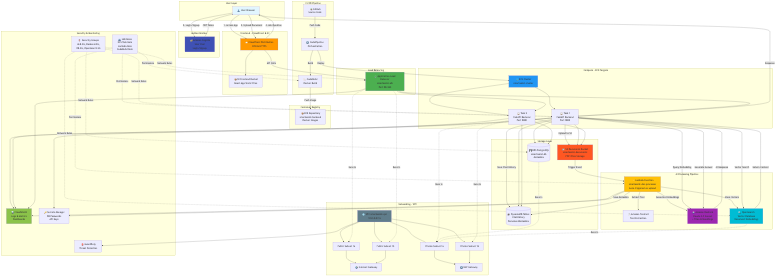

# SmartAssist - AI-Powered Document Assistant

A production-ready RAG (Retrieval-Augmented Generation) system built on AWS, leveraging Amazon Bedrock, OpenSearch, and FastAPI to provide intelligent document-based Q&A capabilities.

## Architecture



## Features

- **Document Upload & Processing**: Automatic text extraction using AWS Textract
- **Vector Search**: Semantic search powered by OpenSearch with embeddings
- **AI Chat**: Intelligent responses using Amazon Nova Pro (Bedrock)
- **Scalable Infrastructure**: Containerized deployment on AWS ECS with auto-scaling
- **CI/CD Pipeline**: Automated deployments via AWS CodePipeline and CodeBuild
- **Secure**: IAM-based authentication with AWS services

## Tech Stack

### Backend
- **FastAPI** - Modern Python web framework
- **LangChain** - AI/LLM application framework
- **boto3** - AWS SDK for Python

### AWS Services
- **Amazon Bedrock** - Foundation models (Nova Pro, Titan Embeddings)
- **Amazon OpenSearch** - Vector database for semantic search
- **AWS Lambda** - Serverless document processing
- **Amazon S3** - Document storage
- **AWS Textract** - Document text extraction
- **Amazon ECS (Fargate)** - Container orchestration
- **AWS CodePipeline/CodeBuild** - CI/CD
- **Amazon ECR** - Container registry
- **Application Load Balancer** - Traffic distribution

## Prerequisites

- AWS Account with appropriate permissions
- Docker installed locally
- Python 3.11+
- AWS CLI configured

## Quick Start

### 1. Clone the Repository

```bash
git clone https://github.com/yourusername/smartassist-backend.git
cd smartassist-backend
```

### 2. Set Up Environment Variables

Copy the example environment file and fill in your values:

```bash
cp env.example .env
```

Edit `.env` with your AWS configuration:

```env
AWS_REGION=your-region
S3_BUCKET_NAME=your-documents-bucket
OPENSEARCH_ENDPOINT=your-opensearch-endpoint.amazonaws.com
BEDROCK_MODEL_ID=amazon.nova-pro-v1:0
EMBEDDING_MODEL_ID=amazon.titan-embed-text-v2:0
```

### 3. Local Development

Install dependencies:

```bash
pip install -r requirements.txt
```

Run the application:

```bash
uvicorn app:app --reload --host 0.0.0.0 --port 8000
```

### 4. Docker Build

```bash
docker build --platform linux/amd64 -t smartassist-backend .
docker run -p 8000:8000 --env-file .env smartassist-backend
```

## 📡 API Endpoints

### Health Check
```bash
GET /health
```

### Upload Document
```bash
POST /upload
Content-Type: multipart/form-data

file: <your-document.pdf>
```

### Chat with AI
```bash
POST /chat
Content-Type: application/json

{
  "query": "What is the main topic of the document?"
}
```

## AWS Deployment

### Step 1: Create Infrastructure

1. **S3 Bucket** - For document storage
2. **OpenSearch Domain** - For vector search
3. **ECR Repository** - For Docker images
4. **ECS Cluster** - For container deployment
5. **Lambda Function** - For document processing

### Step 2: Configure IAM Roles

- **ECS Task Role**: Bedrock, S3, OpenSearch permissions
- **Lambda Execution Role**: Textract, Bedrock, OpenSearch, S3 permissions
- **CodeBuild Role**: ECR push permissions

### Step 3: Deploy Lambda Function

```bash
cd lambda_package
pip install -r requirements.txt -t .
zip -r ../lambda_deployment.zip .
aws lambda update-function-code \
  --function-name smartassist-doc-processor \
  --zip-file fileb://../lambda_deployment.zip
```

### Step 4: Set Up CI/CD Pipeline

1. Push code to GitHub
2. Create CodePipeline with:
   - Source: GitHub
   - Build: CodeBuild (uses buildspec.yml)
   - Deploy: ECS

### Step 5: Configure S3 Event Notification

Link S3 bucket to Lambda function for automatic document processing on upload.

## Architecture Flow

1. **Document Upload**:
   ```
   User → API (/upload) → S3 → Lambda Trigger
   ```

2. **Document Processing**:
   ```
   Lambda → Textract (extract text) → Bedrock (embeddings) → OpenSearch (index)
   ```

3. **Chat Query**:
   ```
   User → API (/chat) → OpenSearch (semantic search) → Bedrock (generate answer) → User
   ```

##  Configuration

### Bedrock Models

The system supports multiple Bedrock models:
- **LLM**: Amazon Nova Pro (configurable)
- **Embeddings**: Titan Embeddings v2

### OpenSearch

- Index name: `documents`
- Authentication: AWS IAM (SigV4)

### Docker

- Base image: `python:3.11-slim`
- Platform: `linux/amd64` (for ECS compatibility)

## File Structure

```
smartassist-backend/
├── app.py                      # FastAPI application
├── requirements.txt            # Python dependencies
├── Dockerfile                  # Docker configuration
├── buildspec.yml              # AWS CodeBuild configuration
├── env.example                # Environment variables template
├── lambda_package/
│   ├── lambda_function.py     # Document processing Lambda
│   └── requirements.txt       # Lambda dependencies
├── architecture-diagram.mmd   # Mermaid architecture diagram
└── README.md                  # This file
```

## Security Best Practices

- All credentials managed via environment variables
- IAM roles for service-to-service authentication
- No hardcoded secrets in code
- HTTPS for all API communications
- VPC isolation for OpenSearch

## Troubleshooting

### Common Issues

1. **OpenSearch Connection Errors**
   - Verify IAM permissions
   - Check security group rules
   - Ensure endpoint is accessible

2. **Bedrock Model Errors**
   - Confirm model availability in your region
   - Check IAM permissions for Bedrock
   - Verify model ID format

3. **Lambda Processing Failures**
   - Check CloudWatch logs
   - Verify Textract permissions
   - Ensure S3 trigger is configured

## 📈 Performance Optimization

- Lambda warm-up for faster processing
- OpenSearch index optimization
- ECS auto-scaling policies
- CloudWatch monitoring and alerts


